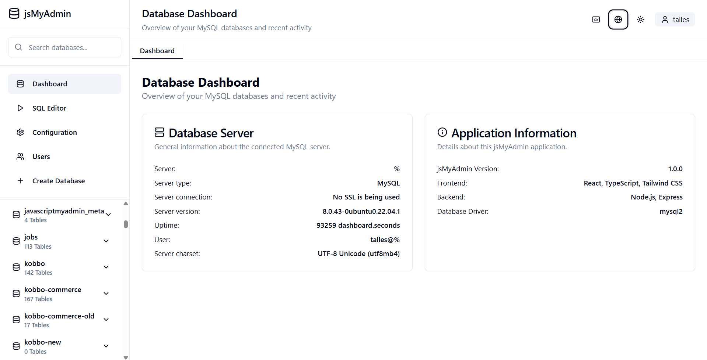
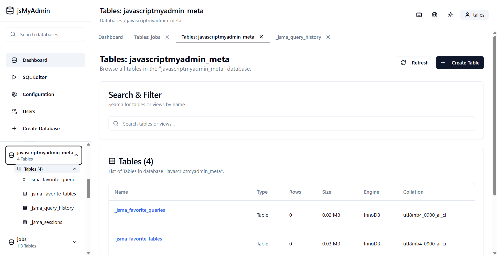
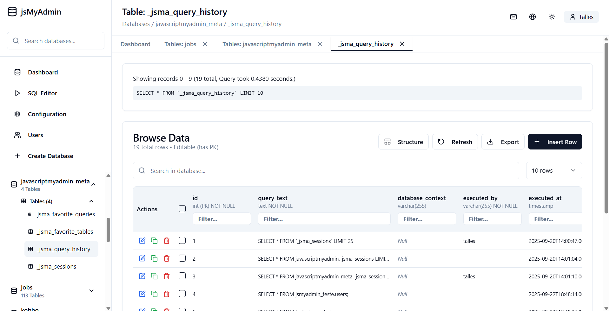

# jsMyAdmin

A modern web-based MySQL administration tool built with React, TypeScript, and Node.js - a complete replacement for phpMyAdmin. This project aims to provide a user-friendly interface for managing your MySQL databases, tables, and data, executing SQL queries, and configuring server settings.



## Features

- 🗄️ **Database Management**: Browse databases, tables, and data with ease.
- 📝 **SQL Editor**: Execute SQL queries with syntax highlighting and save history.
- ⚙️ **Configuration**: Easy database connection setup and application settings.
- 🎨 **Modern UI**: Dark/Light theme with responsive design for various devices.
- 🔒 **Security**: SSL support for secure connections and user privilege management.
- 📊 **Real-time Data**: Live database statistics and monitoring.
- 🚀 **User Management**: View and manage MySQL user accounts and their privileges.
- 🏗️ **Table Structure Editor**: View and modify table structures, including adding, removing, and reordering columns.
- 📤 **Data Export**: Export table data in various formats (CSV, JSON, SQL).





## Prerequisites

Before you begin, ensure you have the following installed:

-   **Node.js**: (v16 or higher) - JavaScript runtime for the backend and frontend build process.
-   **MySQL Server**: (v5.7 or higher) - The database server you wish to manage.
-   **npm** or **yarn**: Package managers for Node.js.

## Installation

Follow these steps to get the project up and running on your local machine:

1.  **Clone the repository**
    ```bash
    git clone <repository-url>
    cd phpmyadmin-clone # Or your project directory name
    ```

2.  **Install dependencies**
    Navigate to the project root and install both frontend and backend dependencies:
    ```bash
    npm install
    # or
    yarn install
    ```

3.  **Configure environment variables**
    Create a `.env` file in the project root by copying the example:
    ```bash
    cp .env.example .env
    ```
    Edit the `.env` file and set your MySQL system user credentials. These credentials are used by the backend to manage system-level operations (like creating meta tables for session management and query history).
    ```dotenv
    PORT=3001
    SESSION_SECRET_KEY="your_super_secure_secret_key_here" # IMPORTANT: Change this to a strong, random key
    MYSQL_SYSTEM_USER="your_mysql_system_user" # e.g., root
    MYSQL_SYSTEM_PASSWORD="your_mysql_system_password"
    ```
    **Important**: Replace `"your_super_secure_secret_key_here"` with a strong, unique secret key. Also, provide credentials for a MySQL user with sufficient privileges (e.g., `root` or a dedicated admin user) for `MYSQL_SYSTEM_USER` and `MYSQL_SYSTEM_PASSWORD`.

4.  **Configure database connection (initial)**
    The `database-config.json` file in the project root holds the default connection settings for the frontend. You can initially set the host and port here, but these can also be updated via the login page.
    ```json
    {
      "database": {
        "host": "localhost",
        "port": 3306,
        "defaultDatabase": "mysql",
        "charset": "utf8mb4",
        "collation": "utf8mb4_unicode_ci",
        "connectionTimeout": 10000,
        "maxConnections": 10,
        "ssl": false,
        "sslCertificate": "",
        "sslKey": "",
        "sslCA": ""
      },
      "application": {
        "theme": "dark",
        "language": "en",
        "queryTimeout": 30000,
        "maxQueryResults": 1000,
        "autoRefresh": false,
        "refreshInterval": 30000
      },
      "security": {
        "allowMultipleStatements": false,
        "allowLocalInfile": false,
        "requireSSL": false
      }
    }
    ```

## Running the Application

### Development Mode

To run both the frontend and backend simultaneously (recommended for development):
```bash
npm run dev:full
# or
yarn dev:full
```

Alternatively, you can run them separately:

**Backend only:**
```bash
npm run server
# or
yarn server
```

**Frontend only:**
```bash
npm run dev
# or
yarn dev
```

### Production Mode

1.  **Build the frontend:**
    ```bash
    npm run build
    # or
    yarn build
    ```

2.  **Start the server:**
    ```bash
    npm run server
    # or
    yarn server
    ```

## Usage

1.  **Access the application** at `http://localhost:5173` (or the port specified by Vite).
2.  **Log in** using your MySQL user credentials (username and password). The host and port will be pre-filled from `database-config.json` but can be changed.
3.  **Initialize System Tables**: If prompted, initialize the system tables (for query history, sessions, etc.) in the `Configuration` tab under the `System` section.
4.  **Browse databases** and tables in the sidebar.
5.  **Execute SQL queries** in the SQL Editor.
6.  **View and edit data** in the Browse Data section for tables with a primary key.
7.  **Manage users** and their privileges in the Users section.
8.  **Configure application settings** and server connection parameters in the Configuration tab.

## API Endpoints

The backend provides the following API endpoints:

-   `POST /api/login` - Authenticate user and establish a session.
-   `POST /api/logout` - End the current user session.
-   `GET /api/session/validate` - Validate the current session and retrieve user profile.
-   `POST /api/test-connection` - Test database connection with provided credentials.
-   `POST /api/save-config` - Save application and database connection configuration.
-   `GET /api/databases` - Get a list of all available databases.
-   `POST /api/databases` - Create a new database.
-   `GET /api/databases/:db/tables` - Get tables and views within a specific database.
-   `POST /api/databases/:database/tables` - Create a new table in a database.
-   `DELETE /api/databases/:database/tables/:table` - Delete a table.
-   `DELETE /api/databases/:database/tables/:table/data` - Truncate (empty) a table.
-   `PUT /api/databases/:database/tables/:table/structure` - Update the structure of a table.
-   `GET /api/databases/:db/tables/:table/data` - Get data from a specific table with pagination and filtering.
-   `PUT /api/databases/:db/tables/:table/cell` - Update a single cell in a table.
-   `PUT /api/databases/:db/tables/:table/row` - Update an entire row in a table.
-   `POST /api/databases/:db/tables/:table/row` - Insert a new row into a table.
-   `DELETE /api/databases/:db/tables/:table/row` - Delete a row from a table.
-   `POST /api/query` - Execute an arbitrary SQL query.
-   `POST /api/query-history` - Save an executed query to history.
-   `GET /api/query-history` - Retrieve query history for the authenticated user.
-   `GET /api/status` - Get general MySQL server status information.
-   `GET /api/users` - Get a list of MySQL users.
-   `GET /api/users/:user/:host/privileges` - Get global and database-specific privileges for a user.
-   `POST /api/users/:user/:host/privileges` - Update global user privileges.
-   `POST /api/users/:user/:host/database-privileges` - Update/add database-specific privileges for a user.
-   `DELETE /api/users/:user/:host/database-privileges` - Revoke all privileges on a specific database for a user.
-   `GET /api/system/status` - Check the status of jsMyAdmin's internal system tables.
-   `POST /api/system/initialize` - Initialize jsMyAdmin's internal system tables.

## Security Features

-   **SSL/TLS Connection Support**: Configure SSL for secure database connections.
-   **Connection Timeout**: Prevent hanging connections.
-   **Query Timeout Limits**: Limit the execution time of SQL queries.
-   **Multiple Statement Control**: Option to enable/disable multiple SQL statements in one query for security.
-   **Local File Access Control**: Option to enable/disable `LOAD DATA LOCAL INFILE` statements.
-   **Session Management**: Secure, token-based session management for user authentication.
-   **Privilege-based Access**: Frontend actions are restricted based on the authenticated user's MySQL privileges.

## Tech Stack

-   **Frontend**: React, TypeScript, Tailwind CSS, shadcn/ui, React Router, i18next
-   **Backend**: Node.js, Express
-   **Database Driver**: mysql2
-   **Build Tool**: Vite

## Contributing

We welcome contributions! If you'd like to contribute, please follow these steps:

1.  Fork the repository.
2.  Create a new branch for your feature or bug fix.
3.  Make your changes and ensure they adhere to the project's coding style.
4.  Test your changes thoroughly.
5.  Submit a pull request with a clear description of your changes.

## License

This project is licensed under the MIT License - see the [LICENSE](LICENSE) file for details.

## Disclaimer from the author
I hold phpMyAdmin in high regard and rely on it in every MySQL project I undertake. It is, without question, an outstanding database client and will likely remain a benchmark for a long time.

jsMyAdmin is my initiative to explore a different approach while striving to build something equally valuable. Perhaps, in the future, it may evolve to the point where comparisons with phpMyAdmin become relevant. At this stage, however, the objective is not to compare, but to focus on improving jsMyAdmin and allowing it to develop its own identity.